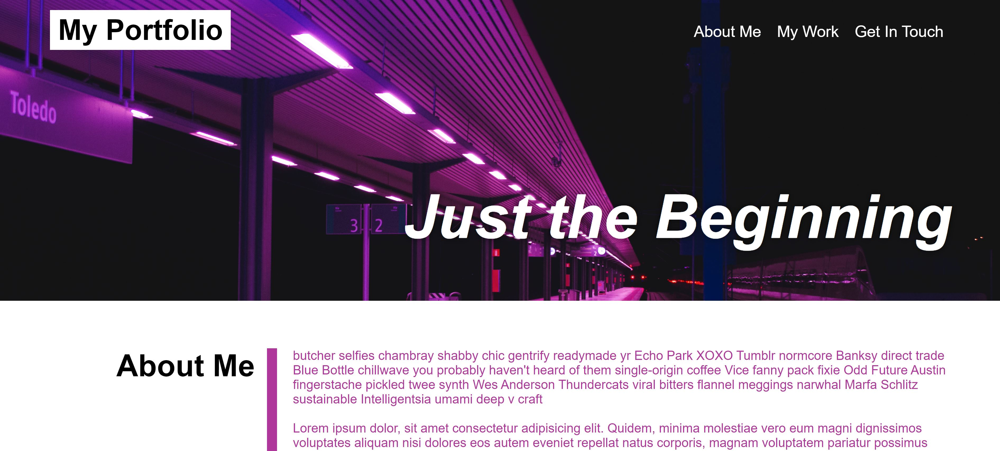

# Personal Portfolio Challenge

## Purpose
Created as a proof of concept portfolio to demonstrate current HTML and CSS skills.

## Website
The actual website can be viewed at the [following link](https://aelisker.github.io/original-portfolio/). The code repository can be found at [here](https://github.com/aelisker/original-portfolio).

You can also find a screenshot of the website below:

## Model
This was modeled off a demo portfolio, shown below:

